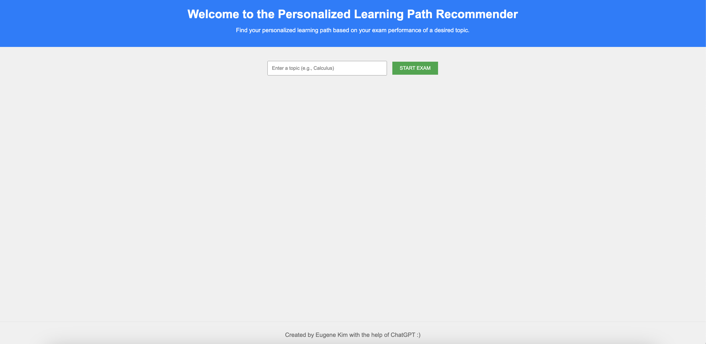
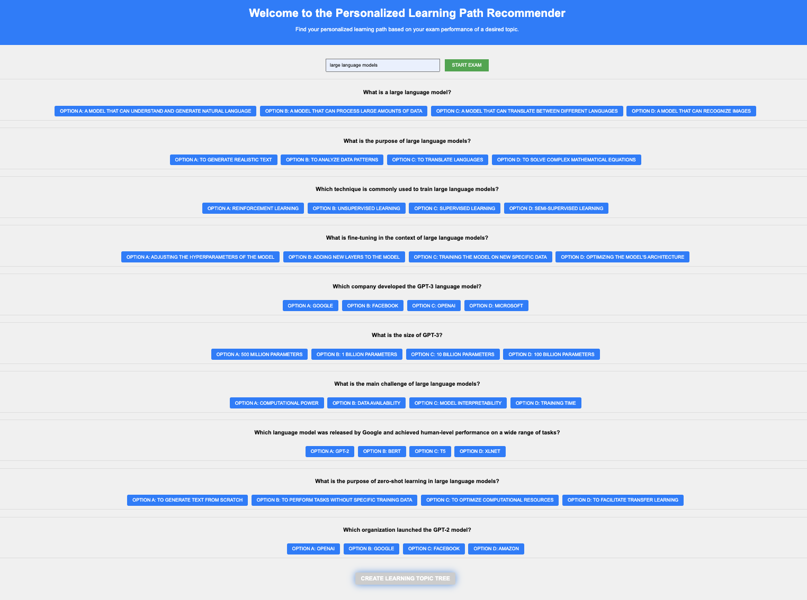
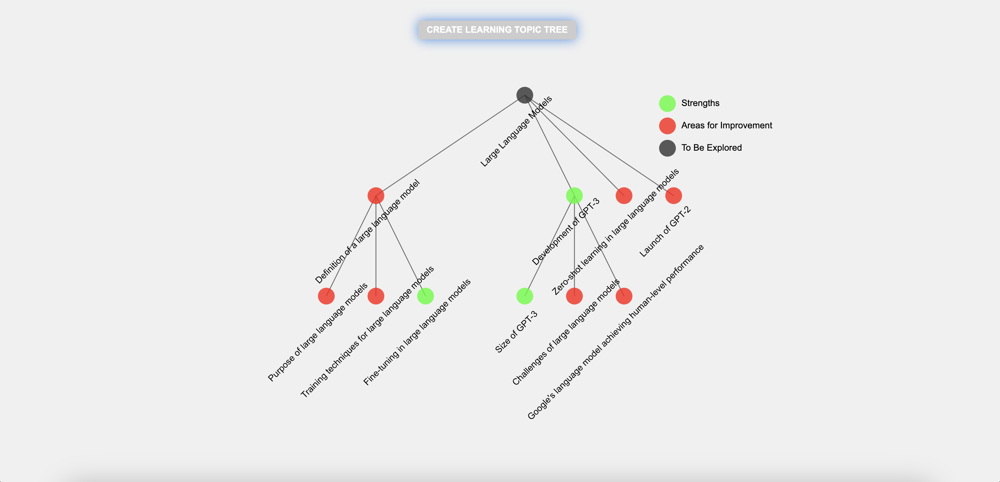

# Personalized Learning Path Recommender

## Motiviation
The Personalized Learning Path Recommender is driven by the recognition that each student's academic background and experiences can significantly impact their readiness for a particular course, and this readiness often varies from one student to another. Traditional educational approaches, with their one-size-fits-all nature, can sometimes miss these individual nuances, potentially leaving some students overwhelmed and others unchallenged. This system seeks to address this disparity by offering a tailored roadmap that acknowledges the diverse backgrounds students come from. Given a user specified subject, the Personalized Learning Path Recommender creates a learning topic tree by analyzing the user's performance in an AI generated exam. It identifies areas of proficiency, areas that need further development, and areas that require more exploration. In doing so, it aims to optimize educational outcomes, ensuring that students are both adequately prepared and actively engaged in their academic journey.

## Getting Started: A Simple Guide

- Enter the topic you wish to explore.
- Click "START EXAM" to generate the exam.
- Answer all questions, then click "Create Learning Topic Tree".
- Review your proficiency, areas for development, and topics needing exploration.

## Screenshots of Demo

